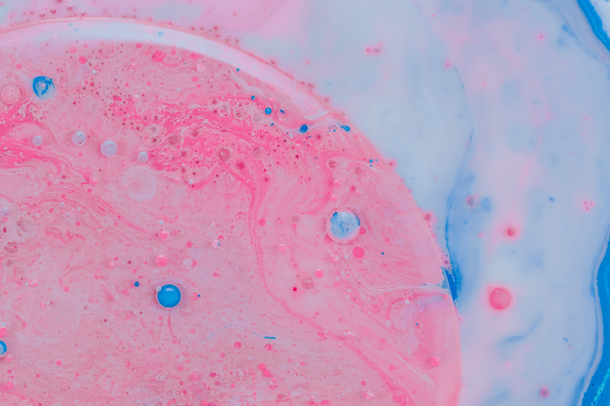

# Plotly.js Graphs

> Belly Graphs on Biodiversity Data. Visualization done with Plotly.js

Photo by <a href="https://unsplash.com/@pawel_czerwinski?utm_source=unsplash&amp;utm_medium=referral&amp;utm_content=creditCopyText">Paweł Czerwiński</a> on <a href="https://unsplash.com/s/photos/cell?utm_source=unsplash&amp;utm_medium=referral&amp;utm_content=creditCopyText">Unsplash</a>

Created an interactive dashboard to explore the Belly Button Biodiversity Data Set and completed an end-to-end analysis. Technologies used: HTML/CSS/Bootstrap, JavaScript Library Plotly, D3.js.

What species are present in your navel?
What is the relative abundance of your common species?
Do some species dominate more than others?
Who are these species?

Color:
#2454a4
#7153ac
#a94da7
#d74896
#f84d7b
#ff635c
#ff8339
#ffa600

- 153 participants are represented in this data set
- display the top ten most commonly found bacteria in a person's belly button
- Each of her volunteers carries a variety of bacterial species in his or her belly button.
- There is also information on the number of bacteria found for each species. The dashboard Roza has in mind will display the most common bacterial species, by count, in the navel.
- If Improbable Beef is looking for people who carry a large number of a certain bacterial species, Roza's volunteers should be able to quickly use the dashboard to figure out whether they are eligible to sell their bacteria to the company.
-

CHARTS

Created a Bar Chart to display the top 10 samples.

https://plotly.com/javascript/bar-charts/

- Used sample_values as the values for the PIE chart
- Used otu_ids as the labels for the pie chart
- Used otu_labels as the hovertext for the chart

- Created a Gauge Chart to plot the Weekly Washing Frequency.

https://plotly.com/javascript/gauge-charts/

- You will need to modify the example gauge code to account for values ranging from 0 - 9.
- Update the chart whenever a new sample is selected

- Created a Bubble Chart to display each sample.

https://plotly.com/javascript/bubble-charts/

- Used otu_ids for the x values
- Used sample_values for the y values
- Used sample_values for the marker size
- Used otu_ids for the marker colors
- Used otu_labels for the text values
